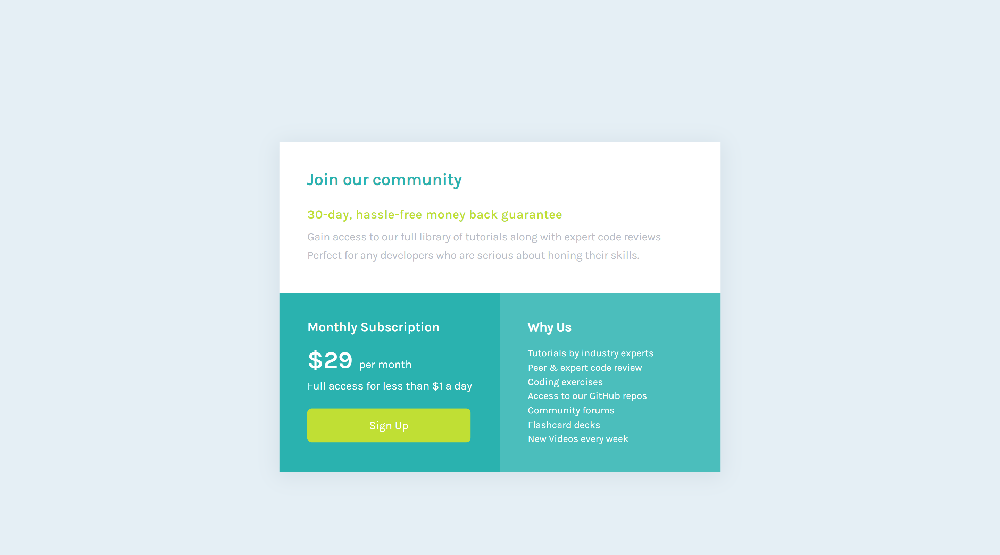

## Table of contents for Rontend Mentor

- [QR code component solution](#qr-code-component-solution)
		- [Screenshot](#screenshot)
		- [Links](#links)
		- [Built with](#built-with)
- [Huddle landing page component solution](#huddle-landing-page-component-solution)
		- [Screenshot](#screenshot-1)
		- [Links](#links-1)
		- [Built with](#built-with-1)
- [Single price grid component](#single-price-grid-component)
		- [Screenshot](#screenshot-2)
		- [Links](#links-2)
		- [Built with](#built-with-2)

# QR code component solution

This is a solution to the [QR code component challenge on Frontend Mentor](https://www.frontendmentor.io/challenges/qr-code-component-iux_sIO_H). Frontend Mentor challenges help you improve your coding skills by building realistic projects. 

### Screenshot

### Links

- Solution URL: [Repo](https://github.com/sledua/readme-post/tree/qr-code-work-gh-pages)
- Live Site URL: [Live GH-pages](https://sledua.github.io/readme-post/qr.html)
### Built with

- Semantic HTML5 markup
- CSS custom properties
- Flexbox
# Huddle landing page component solution
This is a solution to the [Huddle landing page with single introductory section challenge on Frontend Mentor](https://www.frontendmentor.io/challenges/huddle-landing-page-with-a-single-introductory-section-B_2Wvxgi0). Frontend Mentor challenges help you improve your coding skills by building realistic projects. 
### Screenshot

### Links

- Solution URL: [Repo](https://github.com/sledua/readme-post/tree/huddle-dev)
- Live Site URL: [Live GH-pages](https://sledua.github.io/readme-post/huddle.html)
### Built with

- Semantic HTML5 markup
- CSS custom properties
- Flexbox
# Single price grid component
This is a solution to the [Single price grid component](https://www.frontendmentor.io/challenges/single-price-grid-component-5ce41129d0ff452fec5abbbc). Frontend Mentor challenges help you improve your coding skills by building realistic projects. 
### Screenshot

### Links

- Solution URL: [Repo](https://github.com/sledua/readme-post/tree/single-price)
- Live Site URL: [Live GH-pages](https://sledua.github.io/readme-post/single-price.html)
### Built with

- Semantic HTML5 markup
- CSS custom properties
- Flexbox
- JS