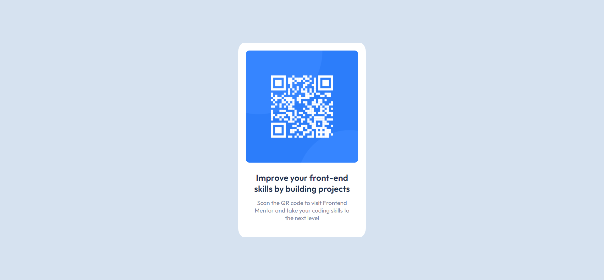

<<<<<<< HEAD
# readme-post - главная ветка 
Начинаю набрасывать текст тут перевод со временем. [New URL](https://github.com/sledua/readme-post).

## Перечень віполненых компонентов, вся жизнь челендж.

-[Frontend Mentor](#Frontend-Mentor)
-[Links](#links)

## Frontend Mentor

## Links
- QR : [QR code component challenge on Frontend Mentor]()
=======
# Frontend Mentor - QR code component solution

This is a solution to the [QR code component challenge on Frontend Mentor](https://www.frontendmentor.io/challenges/qr-code-component-iux_sIO_H). Frontend Mentor challenges help you improve your coding skills by building realistic projects. 
## Table of contents

- [Task for style guide](#Task-for-style-guide)
  - [Screenshot](#screenshot)
  - [Links](#links)
- [My process](#my-process)
# Task for style guide
### Layout
- Mibile: 375px
- Desktop: 1440px
### Colors
- White: hsl(0, 0%, 100%) rgba(255, 255, 255, 1);
- Light gray: hsl(212, 45%, 89%) rgba(214, 226, 240, 1);
- Grayish blue: hsl(220, 15%, 55%) rgba(123, 135, 157, 1);
- Dark blue: hsl(218, 44%, 22%) rgba(31, 50, 81, 1);
## Typography
### Body Copy
- Font size (paragraph) : 15px
### Font
- Famaly [Outfit](https://fonts.google.com/specimen/Outfit)
- Weights: 400, 700
### Screenshot

### Links

- Solution URL: [Repo](https://github.com/sledua/readme-post/tree/qr-code-work-gh-pages)
- Live Site URL: [Live GH-pages](https://sledua.github.io/readme-post/)
## My process

### Built with

- Semantic HTML5 markup
- CSS custom properties
- Flexbox
>>>>>>> qr-code-work-br
